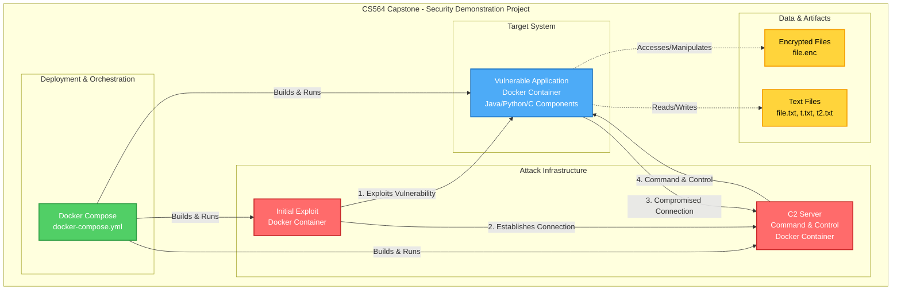

# CS564 Capstone Project

#### Usage:

To Start the vulnerable application:

```
docker compose up vulnerable-application --build
```

To start the C2 server:

```
docker compose up c2 --build
```

To start the exploit.

```
docker compose up initial_exploit --build
```

### Architectural Diagram


